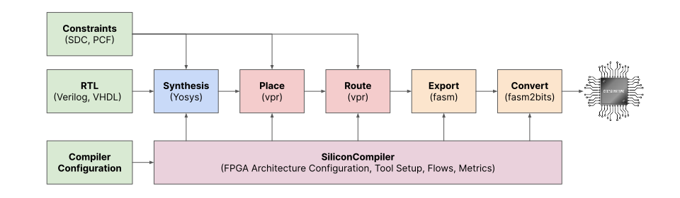

# Logik


## Introduction 

Logik is a light weight configurable open source rtl-to-bitstream FPGA accessible through a simple Python interface. Logik builds on a number of robust open source projects, including:


* [Silicon Compiler](https://github.com/siliconcompiler/siliconcompiler): Hardware build tool
* [Yosys](https://github.com/YosysHQ/yosys): Logic synthesis tool
* [VPR](https://github.com/verilog-to-routing/vtr-verilog-to-routing): FPGA place and route tool 
* [GHDL](https://ghdl.github.io/ghdl/): VHDL parser
* [Surelog](https://github.com/chipsalliance/Surelog): SystemVerilog parser



| Feature              | Status |
|----------------------|--------|
| Languages            | Verilog, SystemVerilog, VHDL
| Bitstream generation | Supported
| RAM mapping          | Supported
| ALU mapping          | Supported
| Pin mapping          | Supported
| SDC                  | Supported (subset)
| Multi-clock          | Work in progress
| STA                  | Work in progress (similar to other open source projects)

## Example

Converting RTL to a bitstream can be done in a few lines of Python code as demonstrated in the [adder example](/examples/adder) show below. 

```python
from siliconcompiler import Chip

chip = Chip('adder')                                        # specify the top module
chip.input('./adder.v')                                     # add an input file
chip.add('fpga', 'partname', 'za')                          # part to compile for     
chip.add('input', 'constraint', 'timing', './adder.sdc')    # timing constraints file
chip.add('input', 'constraint', 'pinmap', './adder.pcf')    # pin constraints file
chip.add('option', 'quiet', True)                           # run in quiet mode
chip.add('option', 'remote', True)                          # run compiler through siliconcompiler.com
chip.add('option', 'output', './adder.bin')                 # name of output bitstream file
chip.run()                                                  # start compilation
chip.summary()                                              # print out a summary of compiler run
```

To verify the functionality of the bitstream, you can upload the adder.bin to an [FPGA Digital Twin](https://www.zeroasic.com/emulation?demo=fpga) made available through the Zero ASIC emulation portal.

## Installation

Logik is available as wheel packages on PyPI for macOS, Windows and Linux platforms. For working Python 3.8-3.12 environment, just use pip.

```sh
python -m pip install --upgrade logik
```

Running Logik natively on a local machine, requires installing all dependencies. Complete installation instructions can be found in the [SiliconCompiler Installation Guie](). For convenience, all EDA tools required by Logik are also packaged as a docker container [HERE]().

## Documentation

## License

[MIT](LICENSE)

## Issues / Bugs
We use [GitHub Issues](https://github.com/zeroasiccorp/logik/issues) for tracking requests and bugs.
