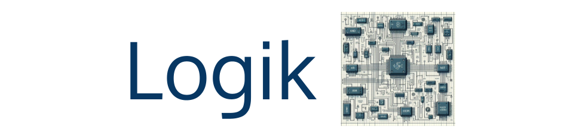

-----------------------------------------------------------------------------------

Logik is a light weight FPGA tool that automates rtl-to-bitstream compilation. The tool is based on a number of mature open source technologies, including:

* [Silicon Compiler](https://github.com/siliconcompiler/siliconcompiler): Hardware compiler framework
* [Yosys](https://github.com/YosysHQ/yosys): Logic synthesis
* [VPR](https://github.com/verilog-to-routing/vtr-verilog-to-routing): FPGA place and route
* [GHDL](https://ghdl.github.io/ghdl/): VHDL parser
* [Surelog](https://github.com/chipsalliance/Surelog): SystemVerilog parser
* [FASM](https://github.com/chipsalliance/fasm): FPGA assembly parser and generator

RTL sources, constraints (timing and pin), and part selection is specified by the user through a simple Python interface derived from the SiliconCompiler project. The SiliconCompiler framework manages the compiliation flow and interacts with the various executables (front ends, synthesis, place-and-route, and bit stream generation) to fully automate the converstion from RTL to bitstream.      


The following example demonstrate the simplicity of the Logik interface:

```verilog
module adder #(DW = 8)
   (
    input [DW-1:0]  a,
    input [DW-1:0]  b,
    output [DW-1:0] y
    );

   assign y = a + b;

endmodule
```


```python
from siliconcompiler import Chip

def hello_adder():

    chip = Chip('adder')                                        # specify the top module
    chip.input('./adder.v')                                     # add an input file
    chip.add('fpga', 'partname', 'za')                          # part to compile for
    chip.add('input', 'constraint', 'timing', './adder.sdc')    # timing constraints file
    chip.add('input', 'constraint', 'pinmap', './adder.pcf')    # pin constraints file
    chip.add('option', 'quiet', True)                           # run in quiet mode
    chip.add('option', 'remote', True)                          # run compiler through siliconcompiler.com
    chip.add('option', 'output', './adder.bin')                 # name of output bitstream file
    chip.run()                                                  # start compilation
    chip.summary()                                              # print out a summary of compiler run
```

To verify the functionality of the bitstream, you can upload the adder.bin to an [FPGA Digital Twin](https://www.zeroasic.com/emulation?demo=fpga) made available through the Zero ASIC emulation portal.


## Hardware Platforms Supported

Logik was launched with day one support for Zero ASICs FPGA chiplets. More architectures will be added if there is interest and support.

## Features

| Feature              | Status |
|----------------------|--------|
| Design Languages     | Verilog, SystemVerilog, VHDL, C, Python
| Bitstream generation | Supported
| Pin mapping          | Supported
| SDC                  | Supported
| Multi-clock          | Work in progress
| STA                  | Work in progress (similar to other open source projects)

## Installation

Logik is available as wheel packages on PyPI for macOS, Windows and Linux platforms. For working Python 3.8-3.12 environment, just use pip.

```sh
python -m pip install --upgrade logik
```

Running Logik natively on a local machine, requires installing all dependencies. Complete installation instructions can be found in the [SiliconCompiler Installation Guie](). For convenience, all EDA tools required by Logik are also packaged as a docker container [HERE]().

## Documentation

## License

[MIT](LICENSE)

## Issues / Bugs
We use [GitHub Issues](https://github.com/zeroasiccorp/logik/issues) for tracking requests and bugs.
