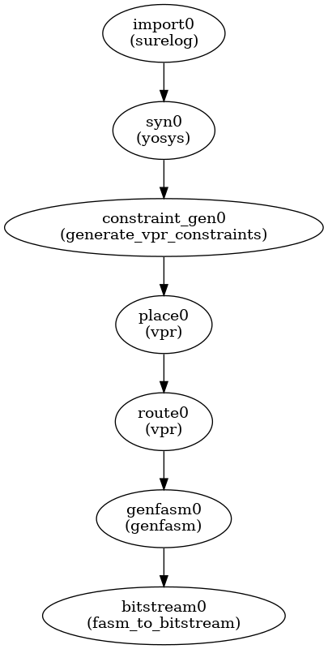

# ebrick-fpga-cad
This repository contains RTL-to-bitstream and other CAD support for ebrick-fpga.

HDL simulation support is not explicitly provided within this repository.  However, [Silicon Compiler](https://siliconcompiler.com) supports HDL simulation flows using open source simulators.  Consult Silicon Compiler documentation for details.

The RTL-to-bitstream flow is implemented as a custom [Silicon Compiler](https://siliconcompiler.com) flow graph:

This README documents how to set up and make use of the software contained in this repository, and how to run example scripts that showcase software features.

## Prerequisites

* Ubuntu 20.04
* Python 3.8 or higher
* git

Github CLI is not required, but recommended.

## Install Required Software

Currently the minimum required tools are:

* [Yosys](https://yosyshq.readthedocs.io/en/latest/tools.html#yosys)
* [VPR](https://docs.verilogtorouting.org),
* [Silicon Compiler](https://docs.siliconcompiler.com).

For VHDL support, [GHDL](https://) is also required.

For SystemVerilog support, [sv2v](https://) is also required.

There are two ways to install the above software tools:
    1. Obtain via Silicon Compiler installation
    2. Build from source yourself.  This requires checking out the qualified versions of the source repositories, which are documented in instructions below

### Silicon Compiler Installation
Silicon Compiler is installed as part of the python package requirements for this repository (see below)

### Yosys Installation
* Clone the [Yosys Github repository](https://github.com/YosysHQ)
* Check out the current qualified version:  `git checkout yosys-0.36`
* Follow the [Yosys build instructions](https://github.com/YosysHQ/yosys?tab=readme-ov-file#installation)
* Add the path to the yosys executable to your PATH environment variable

### VPR Installation
* Clone the [VPR Github repository](https://github.com/verilog-to-routing/vtr-verilog-to-routing/tree/master)
* Check out the current qualified version:  `git checkout c4156f225c7a292c5768444631ca053ea7473428`
* Follow the [VPR build instructions](https://github.com/verilog-to-routing/vtr-verilog-to-routing/blob/master/BUILDING.md)
* Add the paths to the vpr and genfasm executables to your PATH environment variable

### GHDL Installation
* Clone the [GHDL Github repository](https://github.com/)
* Check out the current qualified version:  `git checkout `
* Follow the [GHDL build instructions](https://github.com/`
* Add the path to the ghdl executable to your PATH environment variable

### sv2v Installation
* Clone the [sv2v Github repository](https://github.com/)
* Check out the current qualified version:  `git checkout `
* Follow the [sv2v build instructions](https://github.com/`
* Add the path to the sv2v executable to your PATH environment variable

## Repository Setup
To prepare this repository for use, it is necessary to do the following:

* Clone this repository:  `git clone https://github.com/zeroasiccorp/ebrick-fpga-cad`
* Create a Python virtual environment, e.g. `python3 -m venv venv; source venv/bin/activate`
* Install Python packages within your virtual environment; `pip install --upgrade pip; pip install -r requirements.txt`
* Set up authentication to the Silicon Compiler package registry.

> [!NOTE]
> Currently authentication is validated for Zero ASIC employees only; to set up, set the GIT_TOKEN environment variable in your shell equal to the value of your Github personal access token.

* Append the root directory where you have cloned this repository to your PYTHONPATH; e.g. `export PYTHONPATH=${PYTHONPATH}:${PWD}` if your present working directory is the root directory of your repo clone.

## Running Examples

There are two example circuits provided to demonstrate the Silicon Compiler RTL-to-bitstream flow for ebrick-fpga:  an adder and a FIR filter.  The instructions below are for the FIR filter; running the adder is the same except for the directory and file names that are used.

Within the python virtual environment set up as described above and starting from your ebrick-fpga-cad repo clone root directory, run the following:

* `cd examples/fir_filter/sc`
* `python3 fir_filter.py`

